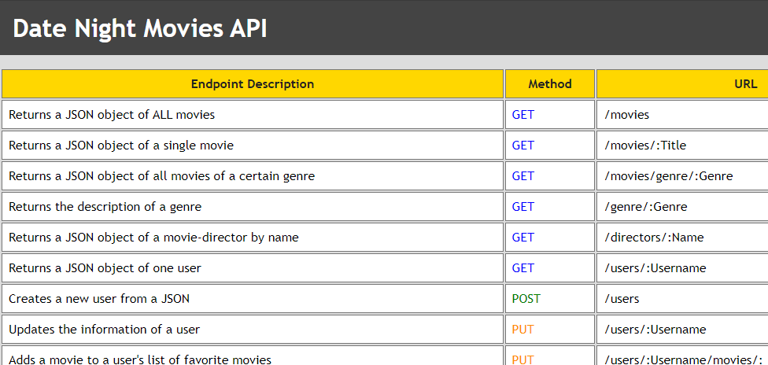
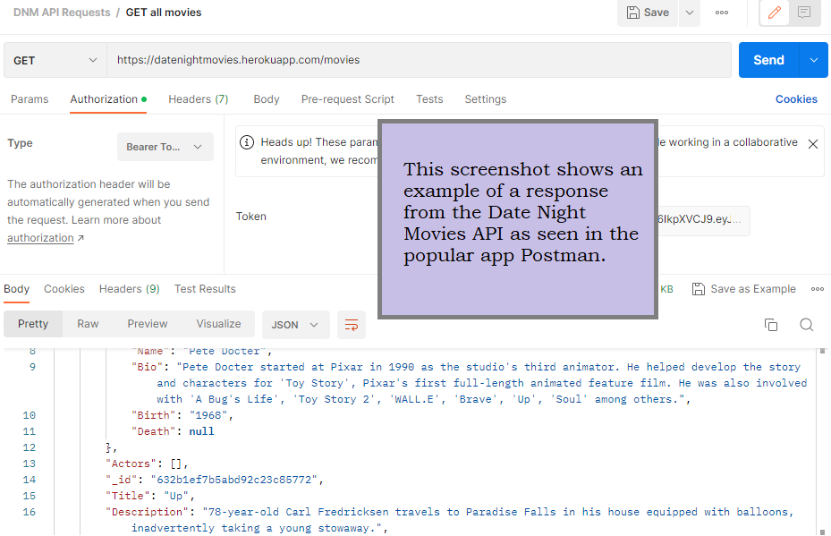

<!-- Markdown syntax here: https://www.markdownguide.org/basic-syntax/ -->
<a id="readme-top"></a>
<br />

<div align="center">
  <a href="https://guyrimel.github.io/Portfolio-Site/index.html">
    
  </a>

  <h3 align="center">Date Night Movies (API)</h3>

  <p align="center">
    This is the backend (RESTful) API that handles HTTP requests and communicates with a MongoDB database of movie and user data. For details about API endpoints, visit the <a href="https://datenightmovies.herokuapp.com/documentation" target="_blank">documentation</a>.
  </p>
</div>
<br />

<!-- TABLE OF CONTENTS -->

<details>
  <summary>Table of Contents</summary>
  <ol>
    <li>
      <a href="#about-the-project">About The Project</a>
      <ul>
        <li><a href="#key-features">Key Features</a></li>
        <li><a href="#built-with">Built With</a></li>
        <li><a href="#deployments">Deployments</a></li>
      </ul>
    </li>
    <li>
      <a href="#getting-started">Getting Started</a>
      <ul>
        <li><a href="#prerequisites">Prerequisites</a></li>
        <li><a href="#installation">Installation</a></li>
        <li><a href="#quick-start">Quick Start</a></li>
        <li><a href="#ux-notes">UX Notes</a></li>
      </ul>
    </li>
    <li><a href="#license">License</a></li>
  </ol>
</details>

<!-- ABOUT THE PROJECT -->

## About The Project

<!-- SCREENSHOT -->



[https://github.com/GuyRimel/Pokedexterity](https://github.com/GuyRimel/Pokedexterity "Date Night Movies (API) Repository")

<!-- KEY FEATURES -->

### Key Features

1. JWT Authentication, password hashing, and secure user logins.
2. View information about movies, genres, and directors.
3. Create a user account with a username and password
3. View information about a user (credentials required)

<p align="right">(<a href="#readme-top">back to top</a>)</p>

<!-- BUILT WITH -->

### Built With

- HTML, CSS, JavaScript
- MongoDB
- Express
- Node.js

<p align="right">(<a href="#readme-top">back to top</a>)</p>

<!-- DEPLOYMENTS -->
## Deployments

Date Night Movies (API) is currently live and hosted with GitHub Pages. This RESTful API is the communication layer for two Date Night Movies frontend deployments, one developed with React and one developed with Angular.

- [Date Night Movies (API)](https://datenightmovies.herokuapp.com/)

- [Date Night Movies React Frontend](https://datenightmovies.netlify.app/)

- [Date Night Movies Angular Frontend](https://guyrimel.github.io/Date-Night-Movies-Angular-Client/)


<p align="right">(<a href="#readme-top">back to top</a>)</p>

<!-- GETTING STARTED -->

## Getting Started

<!-- PREREQUISITES -->

### Prerequisites

1. Git installed globally
  - To automatically download Git for Windows click here: https://git-scm.com/download/win
  - To install Git for macOS run the following in the Terminal:
  ```sh
  $ git --version
  ```
2. Node Version Manager (NVM) AND Node.js installed globally
  - To download both Node.js and NPM, it's advised to first download NVM
  - To download the latest version of NVM for Windows, click here: https://github.com/coreybutler/nvm-windows/releases/lastest
  - Then, in the repository, download and run the `nvm-setup.exe` file
  <br/>
  - To download the latest version of NVM for macOS, first install Homebrew by running the following in the Terminal:
  ```sh
  /bin/bash -c "$(curl -fsSL https://raw.githubusercontent.com/Homebrew/install/master/install.sh)"
  ```
  - Then, with Homebrew, run the following:
  ```sh
  brew install nvm
  ```
  <br/>
  - Note: With NVM installed, you'll also be able to utilize Node Package Mangager (NPM)
  - Finally, With NVM installed, run the following (Windows or macOS):
  ```sh
  nvm install node
  ```
3. Express installed globally
  - Install Express globally by running:
  ```sh
  npm install express -g
  ```

<p align="right">(<a href="#readme-top">back to top</a>)</p>

<!-- INSTALLATION -->

### Installation

1. Clone the repo
   ```sh
   git clone https://github.com/GuyRimel/Date-Night-Movies.git
   ```

<p align="right">(<a href="#readme-top">back to top</a>)</p>

<!-- QUICK START -->

### Quick Start

After installation...

1. Clone the repo
   ```sh
   git clone https://github.com/GuyRimel/Date-Night-Movies.git
   ```

<p align="right">(<a href="#readme-top">back to top</a>)</p>

<!-- UX NOTES -->

## UX Notes

- The navbar displays a totalizer keeping track of how many pokemon you've "caught" (clicked) so far.
- Click on a Pokemon button from the list to see its sprite and information.
- Clicking a Pokemon button now applies a border with a type-based color e.g., a "fire" type Pokemon would get an orange border.

<p align="right">(<a href="#readme-top">back to top</a>)</p>

<!-- SCREENSHOTS -->
## Screenshots




<p align="right">(<a href="#readme-top">back to top</a>)</p>

<!-- LICENSE -->
## License

Distributed under the MIT License. See <a href="LICENSE.txt" target="_blank">`LICENSE.txt`</a> for more information.

<p align="right">(<a href="#readme-top">back to top</a>)</p>
